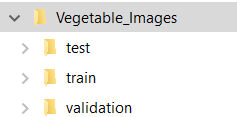
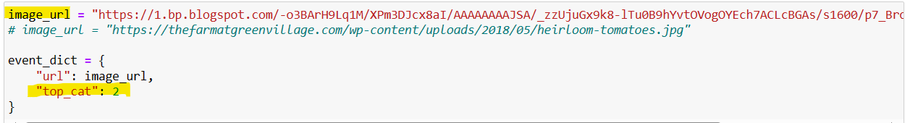
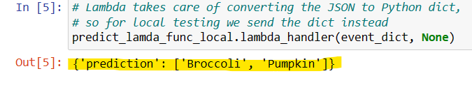
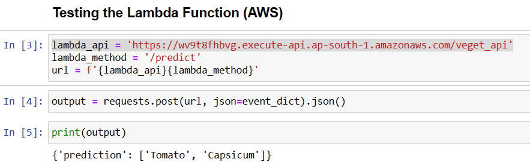

# Vegetable Image classification and recognition

## Project
This project uses Deep Learning to define, build and train a sequential CNN Model using Keras and performs classification and recognition of Vegetable Image. 

This uses dataset composed of images of 15 types of common vegetables. The objective it to recognize and classify vegtable image into one of these 15 catagories using the Model.

Although there are mode popular architectures like Xception, MobileNet v2, for this project I have used simple sequential architecture. This project does simple image classification task.


**Solution Summary**
- Built and train a ML model based on number of images provided as training data in dataset.
- Used keras.Sequential CNN architecture for training the model. Evaluated, tuned and finally Saved the model in HDF5 format
- Converted model in HDF5 to tflite format and tested 
- Created lambda function with prediction functionality. Tested it locally
- Modified the lambda function to use runtime library tflite_runtime.interpreter
- Built a Docker image and tested the lambda function after running the docker image container
- Tagged this Docker Image for aws, pushed and hosted it on ECR Container registry. 
- Defined Lambda function in aws, along with REST API Gateway. Tested it successfully.

**About Dataset**

The dataset contains images of 15 types of common vegetables found throughout the world. The vegetables that are chosen for the experimentation are- bean, bitter gourd, bottle gourd, brinjal, broccoli, cabbage, capsicum, carrot, cauliflower, cucumber, papaya, potato, pumpkin, radish and tomato. A total of 21000 images from 15 classes are used where each class contains 1400 images of size 224×224 and in *.jpg format. The dataset split 70% for training, 15% for validation, and 15% for testing purpose.

[ Kaggle Database used for this project ](https://www.kaggle.com/datasets/misrakahmed/vegetable-image-dataset)


## PROJECT FILES
* `README.md` This file
  * Description of the problem
  * Instructions on how to run the project
* Data - To re-run notebook files to generate and convert the model need to download and store below files locally
  * Download data from: [ Kaggle Database used for this project ](https://www.kaggle.com/datasets/misrakahmed/vegetable-image-dataset)
* `notebook_HDF5.ipynb` with entire code for creating, testing and saving model   
  * Understand data - EDA
  * Preprocess image data
  * Define and compile the model (sequential cnn archiecture with 7 layers)
  * Train the model
  * Check loss and accuracy (train and validation)
  * Evaluate the model on the test data
  * Save the model in  hdf5 format
  * Test the model for random images and check accuracy
* Model `vegetable_classification_model.h5` 
  * Model file saved in HDF5 format
* `notebook_tflite.ipynb` 
  * Convert Model to tflite format from HDF5 Model (vegetable_classification_model.h5) saved from veget_Identification_HDF5.ipynb
  * Test the Model on various Images
      - Load and preprocess the test image
      - Display Predicted Output of top N predicted categories for input image
* Model `vegetable_classification_model.tflite`
  * Converted Model file saved in tflite format
* Script `predict_lamda_func_local.py`
  * Contains code for prediction of Vegetable image as input. 
  * The Lambda function in this code can be locally tested using veget_lamda_local_test.py
* `test_predict_lamda_local.ipynb`
  * Code to locally test lambda function in veget_lamda_func_local.py
* Script`predict_lamda_func_dkr.py`
  * Contains code for prediction of identification of Vegetable image as input. 
  * This uses runtime library tflite_runtime.interpreter, to be used with Docker to build image. 
  * Lambda function in this code can be tested using veget_lamda_docker_test.py.
* `test_predict_lamda_docker.ipynb`
  * Code to test lambda function in docker image containing  veget_lamda_func_dkr.py
  * Need to run the Docker container image generated using Docker file below
* `Dockerfile` 
  * File to use with Docker to build the image which then run it in container locally
* `test_predict_lamda_aws.ipynb`
  * Code to test lambda function hosted on AWS 
  * Please note : As this hosted on paid service this may not be availble after 9th Jan 2024 


## INSTRUCTION TO RUN THE PROJECT
- **If you want to rebuild HDF5 and tflite model from notebooks. Need to do below**
    - In `notebook_HDF5.ipynb`
      - Need to download dataset (Refer Project Files -> Data section above) and unzip
      >
      - Need to change `dataset` variable value to where the downloaded dataset is stored  
      - dataset = 'D:\\1_Arun_Legion\\2_Courses\AI\ML_ZoomCamp\Capstone_Proj_1\Datasets\Vegetable_Images'To build the HDF5 image 
  - `notebook_tflite.ipynb`
    - For this to run `vegetable_classification_model.h5` file must be in same folder as notebook_tflite.ipynb    
- **Alternately and preferably You can use `vegetable_classification_model.tflite` model directly to test vegetable images**
  - *1) test_predict_lamda_local.ipynb*
    - Run this file to test the  prediction by calling lambda function in predict_lamda_func_local.py
    - Following variable values can be changed before running the script 
        image_url - URL of Vegetable Image
        top_cat - Number of Top prediction to return by Lambda function. Leftmost classification is highest prioroty. Setting value of this 1 will predict the top most/most preferred prediction

    - Variables to change
      >  

    - Output
      >  

  - *2) test_predict_lamda_docker.ipynb*
    - Ensure vegetable_classification_model.tflite, veget_lamda_func_dkr.py and Docker file are in same folder on local drive 
      - Build docker image using command docker build -f Dockerfile -t veget-lambda .
      - After image is built run 
      - docker run -it --rm -p 8080:8080 veget-lambda:latest
    - Run test_predict_lamda_docker.ipynb Script to test the  prediction by calling lambda function 
    - Following variable values can be changed before running the script 
        image_url - URL of Vegetable Image
        top_cat - Number of Top prediction to return by Lambda function. Leftmost classification is highest prioroty. Setting value of this 1 will predict the top most/most preferred prediction

 - *2) test_predict_lamda_aws.ipynb*
     -  Run test_predict_lamda_aws.ipynb to test the prediction hosted on aws
     
    
    **Hosting the lamda function on AWS** 
     -  Here are high level steps 
     1) Create user in AWS IAM having necessary credentials
     2) [Install and set up AWS CLI](https://docs.aws.amazon.com/cli/latest/userguide/getting-started-prereqs.html).
     3) [Create a repository in ECR and upload the Docker image](https://docs.aws.amazon.com/AmazonECR/latest/userguide/getting-started-cli.html)
        > *Note : You can create ECR repository using aws web console as well*
     - Using _AWS web Console_ perform following
     4) Set up a _Lambda_ function.
        - Create lambda function
        - Use the Docker image pushed in ECR container
        - Configure lambda function for optimum memory and timeout
        - Test the lambda function using 
        ```
        {
            "url": "https://1.bp.blogspot.com/-o3BArH9Lq1M/XPm3DJcx8aI/AAAAAAAAJSA/_zzUjuGx9k8-lTu0B9hYvtOVogOYEch7ACLcBGAs/s1600/p7_Broccoli_HH1812_gi905351392.jpg",
            "top_cat": 2
        }
        ```
      5) Create an _API gateway_ for the Lambda function. (Use REST API)
        - Create API
        - Create Resource
        - Create Method Here integrate with our Lambda function
        - Test method
        - Deploy API
        - Note "Invoke URL" - This needs to be used as URL in test_predict_lamda_aws.ipynb
      6) Test the lambda hosted on aws using  test_predict_lamda_aws.ipynb
      > 


[This site must be cited when using this dataset](https://www.researchgate.net/publication/352846889_DCNN-Based_Vegetable_Image_Classification_Using_Transfer_Learning_A_Comparative_Study)
